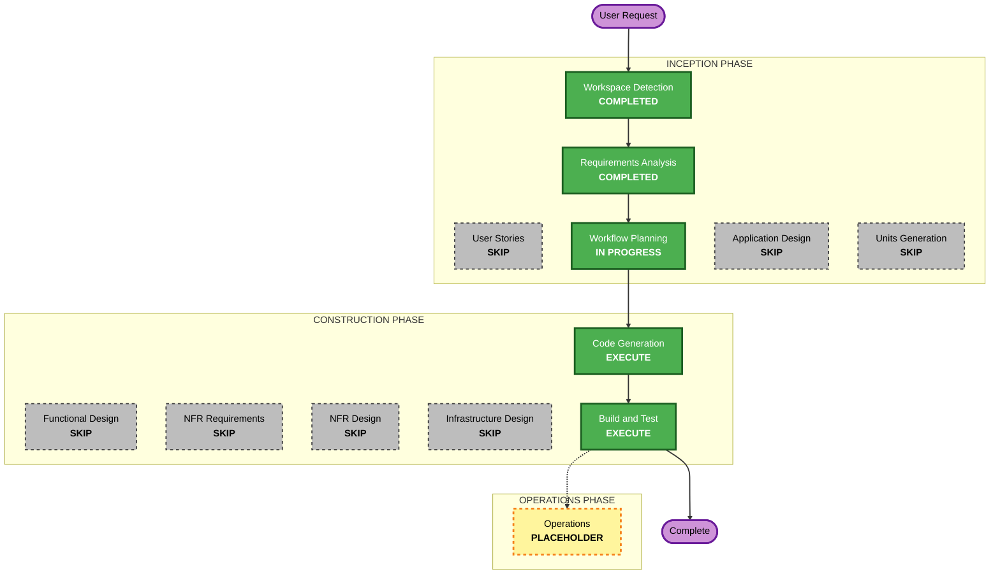

# Execution Plan

## Detailed Analysis Summary

### Change Impact Assessment
- **User-facing changes**: Yes — 신규 웹앱 전체 (단어 CRUD, 외움 체크 UI)
- **Structural changes**: N/A (Greenfield, 기존 구조 없음)
- **Data model changes**: Yes — 신규 데이터 모델 `{id, word, definition, memorized}` 정의 (SQLite 단일 테이블)
- **API changes**: Yes — 신규 REST API 전체 설계 필요 (CRUD + 토글 엔드포인트)
- **NFR impact**: 낮음 — 로컬 단일 사용자 환경, 성능/보안/확장성 요구사항 최소 (확장 규칙 모두 비활성화됨)

### Component Relationships
- **Unit 1 - Backend**: Express REST API + SQLite 데이터 액세스 계층
- **Unit 2 - Frontend**: React SPA (Vite), Backend API를 HTTP로 호출
- **의존 관계**: Frontend → Backend API (단방향), Backend → SQLite 파일(`data/wordbook.db`)

### Risk Assessment
- **Risk Level**: Low (단일 사용자 로컬 CRUD 앱, 잘 알려진 표준 스택)
- **Rollback Complexity**: Easy (로컬 파일 기반, git으로 관리 가능)
- **Testing Complexity**: Simple (CRUD 단위/통합 테스트로 충분)

## Workflow Visualization



### Text Alternative

```
INCEPTION PHASE
- Workspace Detection: COMPLETED
- Requirements Analysis: COMPLETED
- User Stories: SKIP
- Workflow Planning: IN PROGRESS (this document)
- Application Design: SKIP
- Units Generation: SKIP

CONSTRUCTION PHASE (per-unit: backend, frontend)
- Functional Design: SKIP
- NFR Requirements: SKIP
- NFR Design: SKIP
- Infrastructure Design: SKIP
- Code Generation: EXECUTE (always)

FINAL
- Build and Test: EXECUTE (always)

OPERATIONS PHASE
- Operations: PLACEHOLDER
```

## Phases to Execute

### INCEPTION PHASE
- [x] Workspace Detection (COMPLETED)
- [x] Requirements Analysis (COMPLETED)
- [x] User Stories (SKIPPED)
  - **Rationale**: 단일 사용자/단일 페르소나 로컬 CRUD 앱. requirements.md에 기능·시나리오·데이터 모델이 이미 명확. 다중 이해관계자 조율이나 UAT 불필요 (`user-stories-assessment.md` 참조)
- [x] Execution Plan (이 문서)
- [ ] Application Design - SKIP
  - **Rationale**: 신규 컴포넌트/서비스 계층 설계가 필요한 복잡도가 아님. 요구사항에 이미 유닛 구조(백엔드/프론트)와 API 성격(CRUD)이 명시됨. 컴포넌트 경계가 명확하여 별도 설계 단계 불필요
- [ ] Units Generation - SKIP
  - **Rationale**: 요구사항 문서에 이미 "유닛 2개(백엔드+프론트)" 구조가 명시되어 있어 별도 분해 단계 불필요. 아래 "Unit 구조 확정" 섹션에서 바로 확정

### Unit 구조 확정 (Units Generation 대체)
요구사항에서 이미 정의된 구조를 그대로 확정합니다:
- **Unit 1: `backend`** — Express REST API + SQLite 데이터 액세스 (단어 CRUD, 외움 상태 토글 엔드포인트)
- **Unit 2: `frontend`** — React SPA (Vite): 단어 추가 폼, 목록 뷰, 수정/삭제 UI, 외움 체크 토글
- **의존성**: frontend → backend (API 호출), backend → SQLite 파일
- **빌드/실행 순서**: backend 우선 기동 → frontend 개발 서버 기동 (API 베이스 URL로 연결)

### CONSTRUCTION PHASE (per-unit: backend, frontend)
- [ ] Functional Design - SKIP
  - **Rationale**: 데이터 모델과 비즈니스 규칙(필수값 검증, 중복 처리 방식)이 requirements.md에 이미 상세히 정의됨. CRUD 수준의 로직으로 별도 상세 설계 불필요
- [ ] NFR Requirements - SKIP
  - **Rationale**: 성능/보안/확장성 요구사항 없음 (확장 규칙 모두 비활성화). 기술 스택은 요구사항에서 이미 확정(React+Vite, Express, SQLite)
- [ ] NFR Design - SKIP
  - **Rationale**: NFR Requirements가 스킵되므로 해당 없음
- [ ] Infrastructure Design - SKIP
  - **Rationale**: 로컬 실행만 범위. 클라우드/인프라 설계 대상 없음
- [ ] Code Generation - EXECUTE (ALWAYS)
  - **Rationale**: 각 유닛(backend, frontend)의 실제 코드 구현 필요
- [ ] Build and Test - EXECUTE (ALWAYS)
  - **Rationale**: 로컬 빌드, 단위/통합 테스트 실행 및 검증 필요

### OPERATIONS PHASE
- [ ] Operations - PLACEHOLDER
  - **Rationale**: 향후 확장을 위한 자리 표시자. 현 프로젝트는 로컬 실행만 범위이므로 해당 없음

## Package Change Sequence
1. **backend** 유닛 먼저 구현 (API 및 데이터 계층 확정 — frontend가 의존하는 계약)
2. **frontend** 유닛 구현 (확정된 API를 소비)
3. Build and Test에서 두 유닛을 통합 실행하여 검증

## Estimated Timeline
- **Total Stages Executing**: 3 (Workflow Planning, Code Generation ×2 units, Build and Test)
- **Estimated Duration**: 단일 세션 내 완료 가능 (로컬 CRUD 앱 규모)

## Success Criteria
- **Primary Goal**: 로컬에서 실행 가능한 단어 암기 웹 앱 (React + Express + SQLite) 완성
- **Key Deliverables**:
  - `backend/` — Express API 서버 + SQLite 연동, CRUD 및 토글 엔드포인트
  - `frontend/` — React SPA, 단어 관리 UI
  - 단위/통합 테스트, 빌드 및 실행 안내 문서
- **Quality Gates**:
  - requirements.md의 모든 기능 요구사항(FR-1~FR-6) 충족
  - 로컬에서 backend/frontend 정상 기동 및 CRUD 동작 확인
  - 데이터가 서버 재시작 후에도 유지됨 (SQLite 영구 저장 확인)
