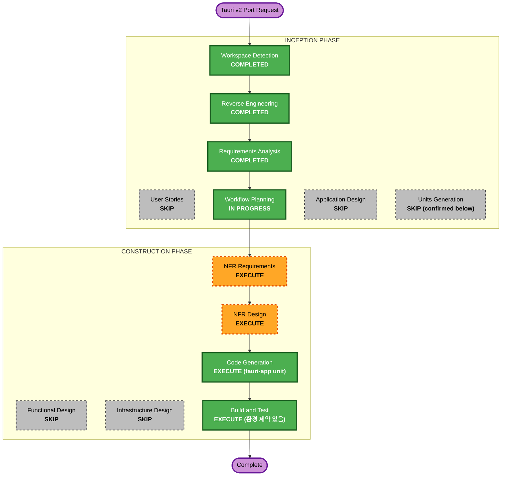

# Execution Plan - Tauri v2 Port

## Detailed Analysis Summary

### Transformation Scope
- **Transformation Type**: 아키텍처 전환 (System-wide) — 신규 유닛(`tauri-app/`) 추가, 기존 유닛(backend/frontend/packaging)은 보존만
- **Primary Changes**: Node.js/Express → Rust/Tauri 커맨드, HTTP REST → Tauri IPC, React(웹) → React(Tauri frontend, 새로 작성)
- **Related Components**: 기존 v1 유닛과 코드 공유 없음 (완전 별도 유닛으로 결정됨, tauri-requirements.md 참조)

### Change Impact Assessment
- **User-facing changes**: 실행 방식 변경(브라우저→데스크톱 앱), 기능적 변화 없음
- **Structural changes**: Yes — 신규 유닛 추가 (기존 구조에 영향 없음)
- **Data model changes**: No (Word 모델 동일하게 유지, DB만 별도 파일)
- **API changes**: HTTP REST → Tauri IPC 커맨드로 전환 (5개 대응)
- **NFR impact**: 있음 — 플랫폼별 빌드/배포 전략 필요 (아래 참조)

### Risk Assessment
- **Risk Level**: Medium — 신규 언어(Rust) 도입, 툴체인 부재(아래 확인됨), 크로스플랫폼 빌드는 부분적으로만 검증 가능
- **Rollback Complexity**: Easy (신규 유닛이므로 기존 시스템에 영향 없음, 실패 시 `tauri-app/` 삭제만으로 원복)
- **Testing Complexity**: Moderate (Rust 단위테스트 + frontend 테스트 + Tauri 통합 실행 검증)

## 사전 확인된 환경 제약 (중요)

- **Rust 툴체인(cargo/rustc) 미설치** — 이 VM에 확인됨. Tauri v2는 Rust 필수이므로, 설치 없이는 Code Generation 후 실제 빌드/실행 검증이 불가능합니다.
- Node.js v24.20.0, npm 11.19.0은 사용 가능 (frontend 개발용)
- **사용자 확인 필요**: Rust 설치를 진행할지 여부 (아래 "다음 단계"에서 질문)

## Workflow Visualization



### Text Alternative
```
INCEPTION: Workspace Detection(완료) -> Reverse Engineering(완료) -> Requirements Analysis(완료)
           -> User Stories(SKIP) -> Workflow Planning(진행중) -> Application Design(SKIP) -> Units Generation(SKIP)
CONSTRUCTION: NFR Requirements(실행) -> NFR Design(실행) -> Code Generation(실행, tauri-app 유닛)
              -> Build and Test(실행, 환경 제약 있음 - 아래 참조)
```

## Phases to Execute

### INCEPTION PHASE
- [x] User Stories - SKIPPED (tauri-user-stories-assessment.md 참조 — 기능 변화 없는 순수 기술 전환)
- [ ] Application Design - SKIP
  - **Rationale**: 신규 컴포넌트 경계가 기존 backend 구조(routes→repository→db)를 Rust로 그대로 대응 가능(commands→db 모듈)하여 별도 설계 불필요. tauri-requirements.md에 이미 5개 커맨드 매핑이 명시됨.
- [ ] Units Generation - SKIP
  - **Rationale**: 신규 유닛은 `tauri-app/` 단 하나로 명확. 별도 분해 단계 불필요.

### Unit 구조 확정
- **Unit: `tauri-app`** — Tauri v2 프로젝트
  - `tauri-app/src-tauri/` — Rust 백엔드 (Cargo 프로젝트, 커맨드 5개, rusqlite 데이터 액세스)
  - `tauri-app/src/` — React frontend (Vite, Tauri 관례에 맞게 새로 작성)
  - `tauri-app/.github/workflows/` 또는 저장소 루트 `.github/workflows/` — CI 매트릭스 (3-OS, 실행 미검증)
- **기존 유닛(backend/frontend/packaging)**: 코드 보존, 변경 없음, 신규 개발 대상 아님

### CONSTRUCTION PHASE
- [ ] Functional Design - SKIP
  - **Rationale**: 데이터 모델/비즈니스 규칙이 tauri-requirements.md에 이미 상세 정의됨 (v1과 동일)
- [ ] NFR Requirements - **EXECUTE**
  - **Rationale**: 신규 기술 스택(Rust) 선택, 플랫폼별 빌드 전략, CI 구성이 필요 — 표준 NFR 영역(빌드/배포 아키텍처)에 해당
- [ ] NFR Design - **EXECUTE**
  - **Rationale**: NFR Requirements에서 도출된 크로스플랫폼 빌드/패키징 패턴을 구체적 설계로 반영
- [ ] Infrastructure Design - SKIP
  - **Rationale**: 클라우드/서버 인프라 없음 (로컬 데스크톱 앱), GitHub Actions는 NFR Design에서 함께 다룸
- [ ] Code Generation - EXECUTE (ALWAYS)
- [ ] Build and Test - EXECUTE (ALWAYS, 단 아래 환경 제약 적용)

## 환경 제약 및 검증 범위

| 플랫폼 | 빌드 설정 준비 | 실제 실행/테스트 검증 |
|---|---|---|
| Linux (Ubuntu, 이 VM) | O | **O (Rust 설치 시에만 가능)** |
| Windows | O (tauri.conf.json, CI) | X (환경 없음) |
| macOS | O (tauri.conf.json, CI) | X (환경 없음) |

**Rust 툴체인이 설치되지 않은 상태입니다.** Code Generation 진행 전 설치 여부를 확인해야 합니다 (다음 단계에서 질문).

## Success Criteria
- **Primary Goal**: `tauri-app/` 유닛으로 Tauri v2 데스크톱 앱 완성, Linux에서 실제 빌드/실행 검증
- **Key Deliverables**:
  - `tauri-app/src-tauri/` — Rust 커맨드 5개 + rusqlite 데이터 계층 + 단위 테스트
  - `tauri-app/src/` — React frontend (새로 작성) + 컴포넌트 테스트
  - `.github/workflows/` — 3-OS 빌드 매트릭스 CI 파일 (실행 미검증)
  - Linux `.deb` 빌드 결과물 (Tauri bundler)
- **Quality Gates**:
  - FR-T1~FR-T6 모두 Rust 커맨드로 구현 및 테스트
  - Linux에서 실제 `tauri dev` 및 `tauri build` 성공
  - Windows/macOS는 설정 파일 존재 및 문법 유효성까지만 확인 (실행 불가 명시)
