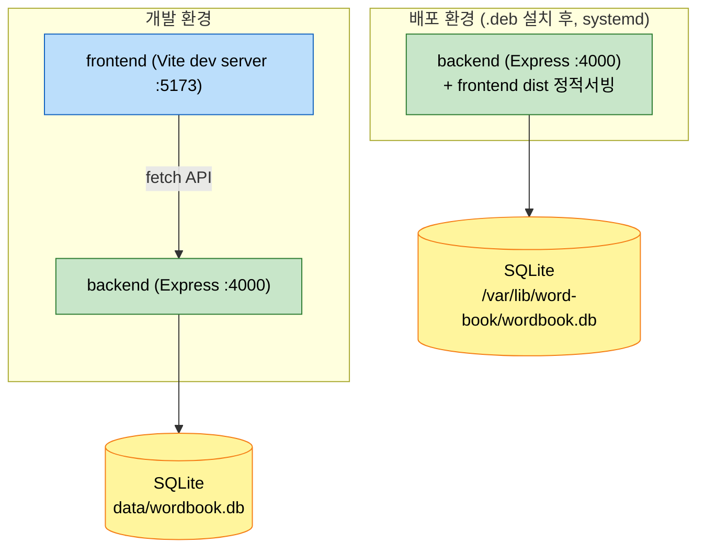
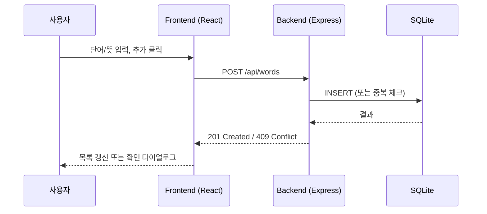

# System Architecture

## System Overview

Word Book은 3개 유닛으로 구성된 로컬 단일 사용자용 웹 애플리케이션이다: `backend`(REST API+SQLite), `frontend`(React SPA), `packaging`(.deb+systemd 배포).
개발 환경에서는 두 프로세스(backend:4000, frontend dev server:5173)가 분리 실행되고, 배포판(.deb 설치 후)에서는 backend가 frontend 빌드 결과물을 정적 파일로 함께 서빙하여 단일 프로세스/포트(4000)로 통합된다.

## Architecture Diagram

## Component Descriptions

### backend
- **Purpose**: 단어 CRUD REST API 및 SQLite 영속성
- **Responsibilities**: 라우팅(`wordsRouter.js`), 데이터 액세스(`wordRepository.js`), DB 초기화(`database.js`), 앱 조립(`app.js`), 정적 파일 서빙(옵션)
- **Dependencies**: `express`, `cors`, Node.js 내장 `node:sqlite`
- **Type**: Application

### frontend
- **Purpose**: 단어장 관리 웹 UI
- **Responsibilities**: 컴포넌트(`WordForm`, `WordList`, `WordItem`, `ConfirmDialog`), 상태관리(`App.jsx`), API 클라이언트(`wordsApi.js`)
- **Dependencies**: `react`, `react-dom`, Vite 빌드 도구
- **Type**: Application

### packaging
- **Purpose**: Debian 계열 배포 자동화
- **Responsibilities**: `.deb` 빌드(`build-deb.sh`), systemd 유닛, 설치/제거 스크립트
- **Dependencies**: `dpkg-deb`, systemd, Node.js 런타임(대상 시스템에 설치 필요)
- **Type**: Infrastructure/Deployment

## Data Flow

## Integration Points
- **External APIs**: 없음 (완전 로컬 앱)
- **Databases**: SQLite (파일 기반, `node:sqlite` 내장 드라이버)
- **Third-party Services**: 없음

## Infrastructure Components
- **Deployment Model**: 로컬 systemd 서비스 (Debian/Ubuntu), 또는 개발자 로컬 실행(npm)
- **Networking**: localhost 전용, CORS는 `localhost:5173`만 허용
