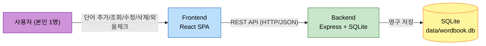

# Business Overview

## Business Context Diagram



### Text Alternative
```
사용자 -> Frontend(React SPA) -> [REST API] -> Backend(Express) -> SQLite(data/wordbook.db)
```

## Business Description

- **Business Description**: 로컬 단일 사용자를 위한 단어 암기 웹 애플리케이션. 사용자가 단어와 뜻을 입력해 개인 단어장을 만들고, 외움 여부를 체크하며 학습 상태를 관리한다.
- **Business Transactions**:
  1. **단어 등록** — 단어+뜻 입력, 중복 시 확인 후 강제 등록 가능
  2. **단어장 조회** — 최근 추가순으로 전체 목록 확인
  3. **단어 정보 수정** — 기존 단어/뜻 갱신
  4. **단어 삭제** — 확인 절차를 거쳐 항목 제거
  5. **암기 상태 토글** — 외움/안외움 상태 전환
- **Business Dictionary**:
  - **단어(Word)**: 학습 대상이 되는 어휘 항목
  - **뜻(Definition)**: 단어의 의미/정의
  - **외움(Memorized)**: 사용자가 해당 단어를 암기했다고 표시한 상태 (boolean)

## Component Level Business Descriptions

### backend
- **Purpose**: 단어장 데이터의 영속성 관리 및 CRUD API 제공
- **Responsibilities**: 입력 검증, 중복 처리 정책 적용, SQLite 데이터 액세스, REST API 노출

### frontend
- **Purpose**: 사용자가 단어장을 관리할 수 있는 웹 UI 제공
- **Responsibilities**: 폼 입력/검증 UX, 목록 표시, 확인 다이얼로그(삭제/중복), backend API 호출

### packaging
- **Purpose**: 로컬 Linux(Debian/Ubuntu) 환경에 앱을 설치형 서비스로 배포
- **Responsibilities**: .deb 패키지 빌드, systemd 서비스 등록, frontend 정적 파일을 backend에 통합 서빙
